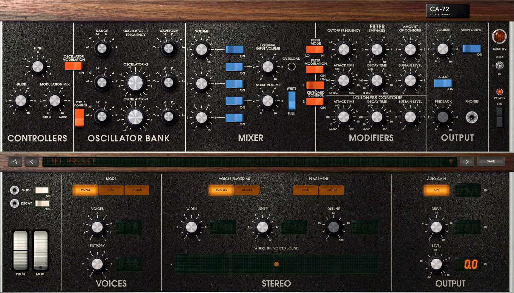

# CA-72

A synthesizer plug-in, VST3 and CLAP for macOS, Windows and Linux and an Audio Unit for macOS,
by Idle Foundry:
monophonic like the instrument it models, or one whole instrument per note with POLY. Its
voice is modelled from the circuit of a 1970s analogue synthesizer, the
Minimoog Model D of about 1972-73 with the CA3046 ("old") oscillator board. Every board
was transcribed from the instrument's service documents into SPICE netlists and simulated
in ngspice. The real-time models were then derived from those simulations and tested
against them, the factory calibration procedures included.

[](https://youtu.be/QLfwGqYg4wU)

Hear it before you download: [the CA-72 on YouTube](https://youtu.be/QLfwGqYg4wU).

It is free software under the GNU General Public License, version 3 or later. Copyright ©
2026 Idle Foundry Ltd.

**Status:** 0.1.5: on machines of 3 and 4 processors the POLY presets no longer overload the
CPU, and on Linux the editor's window is opaque, since 0.1.4. The macOS installer is signed and
notarised; the Windows one is not yet signed.

## Installing

1. Download the installer for your computer from the
   [latest release](https://github.com/idlefoundry/ca-72/releases/latest):

   | Computer | Download |
   |---|---|
   | macOS 11 or later, Apple silicon or Intel | `CA-72-<version>-macOS.pkg` |
   | Windows 10 or 11, 64-bit | `CA-72-<version>-Windows-setup.exe` |
   | Linux, x86-64 (Ubuntu 22.04, Debian 12, Fedora 36 or later) | `CA-72-<version>-Linux-x86_64.tar.gz` |

2. Run it. On Linux, unpack it and run the script in its folder:

   ```sh
   tar xzf CA-72-<version>-Linux-x86_64.tar.gz
   cd CA-72-<version>-Linux-x86_64
   ./install.sh
   ```

3. In your host, rescan the plug-ins or restart it. The CA-72 appears as an instrument by
   Idle Foundry, in VST3 and CLAP, and on macOS as an Audio Unit too (in Logic Pro and
   GarageBand, under **AU Instruments › Idle Foundry**). The macOS installer has the Audio
   Unit from 0.1.2 on.

The Windows installer is not yet signed, so the first time you run it Windows says "Windows
protected your PC": click **More info**, then **Run anyway**. To install by hand instead,
each release from 0.1.5 has `CA-72-<version>-Windows-x86_64.zip`: the same VST3 and CLAP, with
a `README.txt` that says where to copy them.

The plug-ins go into the usual folders:

| | VST3 | CLAP | Audio Unit |
|---|---|---|---|
| macOS | `/Library/Audio/Plug-Ins/VST3` | `/Library/Audio/Plug-Ins/CLAP` | `/Library/Audio/Plug-Ins/Components` |
| Windows | `C:\Program Files\Common Files\VST3` | `C:\Program Files\Common Files\CLAP` | |
| Linux | `~/.vst3` (`/usr/lib/vst3` with `./install.sh --system`) | `~/.clap` (`/usr/lib/clap`) | |

To uninstall: on macOS, delete `CA-72.vst3`, `CA-72.clap` and `CA-72.component` from those
folders; on Windows,
find **CA-72** in **Settings › Apps** and choose **Uninstall**; on Linux, run
`./install.sh --uninstall` (`./install.sh --uninstall --system` for a system-wide copy). Your
presets are kept.

**Updating.** Open the presets' drawer (click the preset's name under the panel) and click
**CHECK FOR UPDATES** at its top right, beside the version you have. If a newer release is
out, **DOWNLOAD** opens its installer for your computer in your browser: close your host,
then run it as above. The CA-72 checks only when you click, through your system's `curl`,
and sends nothing of yours.

## Playing it



- **Keys:** every MIDI note plays. Notes 41 to 84 are the instrument's 44 keys, F to C
  (with RANGE at 8'); beyond them the plug-in continues the key string's scale, a key a
  semitone, which the instrument cannot do. Like the instrument, the keyboard gives the
  lowest note held priority and triggers once while keys are held. Far above the keys
  (with RANGE, FREQUENCY and the PITCH wheel high as well) an oscillator stops rising, far
  past the audio band.
- **POLY** (under the panel, not the instrument's): off, the one instrument as above. On,
  each note plays a whole instrument of its own, with its own keyboard circuit, contours
  and glide, up to VOICES of them (2 to 10). A new note takes a free voice, else the
  oldest of those let go, else the oldest held; a voice that was still held lifts its key
  and presses the new one 13 ms later, so its contours start again (the circuit re-arms
  its trigger only after about 12 ms, and so the note's pitch and attack come 13 ms
  late). The wheels reach every voice. Switching POLY stops the notes sounding.
- **ENTROPY** (0 to 100 %, off by default): each voice its own parts, as if built from a
  different batch: the three oscillators' tuning, the filter's cutoff and EMPHASIS, the
  contours' times and GLIDE, each off by a little; the oscillators and the cutoff drift
  slowly and waver. It applies to the one voice with POLY off too. At 0 each oscillator
  still keeps a tiny mismatch and drift of its own, as no two real ones are the same:
  perfectly identical oscillators lock in phase and sound louder, not better. The host
  parameter **Lock** makes them identical (the circuit as drawn), its level matched.
- **SPREAD** (0 to 100 %, off by default): POLY's voices across the stereo field, the
  first in the centre and the next alternately left and right. With POLY off the voice
  stays in the centre.
- **Wheels:** MIDI pitch bend moves the pitch by MIDI BEND RANGE semitones (2 by
  default), and the modulation wheel (CC 1) moves the MODULATION wheel. All sound off,
  reset all controllers and all notes off (CC 120, 121 and 123) are followed.
- **External input:** the host's side chain is the panel's EXTERNAL INPUT, through its
  MIXER switch and VOLUME.
- **Output:** stereo, the same on both channels unless SPREAD places POLY's voices; on a
  mono output, the two channels together.
- **FEEDBACK** (the phones' VOLUME knob, 0 by default): the instrument has no overdrive
  control; players cable its PHONES output into EXTERNAL INPUT. This knob is that cable:
  turn it up, switch the MIXER's EXTERNAL INPUT on and raise its VOLUME, and the output
  overdrives the external input's preamplifier and the mixer (OVERLOAD lights). With it on
  a voice costs about a fifth more.
- **POWER** is the host's bypass: the output fades out over 10 ms and back in.

The editor works like the panel:

- **Knobs:** drag up or down, or use the mouse wheel. Hold Shift to turn finely, and
  double-click to return a control to its default.
- **RANGE and WAVEFORM:** drag or scroll, click either side to step, or click a printed
  position to go straight to it.
- **Switches:** click.
- **Wheels:** drag. The PITCH wheel settles into its centre detent when let go near it.
- **Size:** the editor opens at 80 % of the screen's usable width. Drag the grip at the
  bottom right corner to change it. The panel keeps its proportions, and a size you set
  is saved with the session.

Hovering over a control shows its name and value.

Under the panel, a strip holds the presets' selector and the plug-in's own controls (not the
instrument's): POLY (click), VOICES (click either side to step), and ENTROPY and SPREAD (drag
the slider; the switch beside each turns it off and back on at its amount). SPREAD is
dimmed while POLY is off, and FEEDBACK while EXTERNAL INPUT is closed.

**Presets.** At the strip's left: the preset last chosen (marked • once you change it), a
star to make it a favourite, the previous and next preset, and SAVE…. A preset holds every
control but the PITCH wheel, POWER and MIDI BEND RANGE (your keyboard's, which choosing a
preset leaves as it is), POLY, VOICES, ENTROPY and SPREAD among them. Click
the name and a drawer opens below the strip, the window growing to hold it (in a host that
will not resize the window, it slides up over the panel instead):

- Type to search names, descriptions and tags; FAVOURITES and MINE filter, and so does
  each tag's chip. Click a preset, or use the arrow keys, to choose it; double-click it to
  choose it and close the drawer. The mouse wheel or a trackpad scrolls the list.
- Each row has a star, RENAME, TAGS, DELETE (asked first) and, for a factory preset you
  edited, REVERT. SAVE AS saves the current sound, named and tagged; naming it as a
  factory preset saves yours in its place. Names are told apart regardless of case, and a
  few cannot be used on any system: `factory`, and Windows' device names such as `CON`.
- Factory presets are never lost: deleting one hides it, and RESTORE FACTORY brings it
  back.
- Enter commits a field (in the search, closes the drawer); Escape takes back an edit or
  closes it. While the drawer is open it takes the keyboard. On macOS the host keeps its
  Command and Control shortcuts; on Windows they wait until the drawer shuts, when the
  keyboard goes back to the host; on Linux the editor has the keys while the pointer is
  over it.

The library is a folder of files, `Idle Foundry/CA-72/Presets` in your user data folder
(`~/Library/Application Support` on macOS, `%APPDATA%` on Windows, `~/.local/share` on
Linux). The twenty-four factory
presets are built in, among them a drum kit and a riser made on the panel alone (Ladder
Kick, Noise Snare, Closed Hat, Open Hat, Noise Crash, Pink Riser: one instance a drum) and
Warped Pad, eight POLY voices drifting with ENTROPY.

## MIDI Learn

From 0.1.3 on.

A knob, fader or button of a MIDI controller can move a control of the CA-72:

1. Right-click the control and choose **MIDI LEARN**. It is ringed, and a note over it says
   it is waiting.
2. Move the knob, fader or button. That controller, on its MIDI channel, is now the
   control's; the note names it (`CH 1 · CC 74`). The message that taught it changes nothing;
   the next ones move the control.

The control's menu names its controller; **REMOVE MIDI ASSIGNMENT** takes it away (the sound
stays as it is). Escape, **CANCEL MIDI LEARN** in the menu, or closing the editor stops
waiting, and the controllers learned before are kept. Choosing **MIDI LEARN** on another
control while one waits moves the waiting there.

**The list.** The **MIDI** button in the presets' drawer (or **MIDI ASSIGNMENTS…** in a
control's menu) shows every control that can be learned and its controller, with LEARN,
REMOVE and CANCEL. It works from the keyboard: Up and Down choose a control (a letter jumps
to the next one beginning with it), Enter learns it or stops waiting, Delete or Backspace
removes its controller, Escape stops waiting and then closes the drawer. It is the only way to
learn **LOCK**, which has no control on the panel.

**What can be learned:** the panel's knobs, RANGE and WAVEFORM, and its switches, the left
hand controller's GLIDE and DECAY switches, and POLY, VOICES, ENTROPY, SPREAD and LOCK. Not
the PITCH and MODULATION wheels (MIDI pitch bend and the modulation wheel, CC 1, move them
already), POWER (your host's bypass), MIDI BEND RANGE, nor the presets.

**Controllers that are not learned:** CC 0 and 32 (bank select), CC 1 (the modulation
wheel), CC 6, 38 and 96–101 (data entry, RPN and NRPN), and CC 120–127 (the channel mode
messages). Moving one while a control waits says so, and it waits on. CC 1, 120 (all sound
off), 121 (reset all controllers) and 123 (all notes off) do what they always did.

**How a controller moves a control:** its value, 0 to 127, sets a knob to that share of its
travel (127 is the top); RANGE and WAVEFORM to one of their six positions, each an equal
share of 0–127 (VOICES, its nine); a switch off at 0–63 and on at 64–127. The control goes
straight to the controller's value at its first message ("jump" takeover: it does not wait
for the controller to pass the control's position). What you hear of a knob follows it over
10 ms, so that its steps of 1/127 do not zip; the control itself, your host and a saved
project have the new value at once.

**One controller a control, one control a controller.** A controller is its number and its
MIDI channel, shown 1 to 16: CC 74 on channel 1 and CC 74 on channel 2 are two controllers.
Learning a control again replaces its controller. Learning a controller another control has
moves it, and the note says which control lost it.

**Where they are kept:** with the CA-72 in your host's project, each instance its own, and
in your host's own presets of the plug-in. Not in the CA-72's presets: choosing, saving or
reverting one leaves the controllers as they are. A project saved before MIDI Learn opens
with none.

**Recording and automation.** What your host records is the controller's MIDI, on the track;
the CA-72 tells the host each new value so that its display follows. In CLAP it asks the host
not to record that as automation as well, though not every host honours it (Bitwig Studio 5.2
then leaves its own display of the control as it was, though the control has moved). VST3 and
Audio Units have no such request: a host that writes automation for a plug-in's own changes may
record the move as automation too. Ableton Live 12 does, while its Automation Arm is on: the
clip gets the controller and the track gets the control's automation, and playing the clip back
moves the control, which Live takes as overriding that automation (its Re-Enable Automation
button lights). REAPER 7 does while a track's automation is in Write mode, in CLAP as in VST3,
and its undo history takes a learned move as an edit of the parameter. Record controller moves
with the track's automation only read (Live's Automation Arm off, REAPER's Trim/Read). A
learned controller and your host's automation of the same control take turns: the later one
holds, and at the same moment the controller's.

**Hosts' MIDI.** Live 12 passed the CA-72's VST3 a controller sent on channel 2 as channel 1,
so there a controller is learned as `CH 1` whatever channel it sends on, and the same CC number
on two channels is one controller; REAPER keeps the channels apart. REAPER may set a controller
a track's MIDI used back to 0 when playback stops (it did when tried), and a learned control
follows it there.

**Escape in REAPER on Windows.** REAPER closes its plug-in window at Escape, which stops MIDI
Learn waiting too, unless that window's **Send all keyboard input to plug-in** is on; the
arrows, Enter and Delete reach the MIDI list either way.

## Building

You need [rustup](https://rustup.rs), which installs the Rust that `rust-toolchain.toml`
names (1.97.1) the first time you build, and a C compiler:

- **macOS:** the Xcode command line tools: `xcode-select --install`.
- **Windows:** Visual Studio's Build Tools, with "Desktop development with C++".
- **Linux:** a C compiler, pkg-config and the X11 headers for the editor's window:

  ```sh
  sudo apt install build-essential pkg-config libx11-dev libx11-xcb-dev libxcb1-dev  # Debian, Ubuntu
  sudo dnf install gcc pkgconf-pkg-config libX11-devel libxcb-devel                  # Fedora
  sudo pacman -S base-devel libx11 libxcb                                             # Arch
  ```

Then:

```sh
git clone https://github.com/idlefoundry/ca-72.git
cd ca-72
cargo xtask bundle ca72-plugin --profile bundle
```

This takes a minute or two and writes `target/bundled/CA-72.vst3` and
`target/bundled/CA-72.clap`, link-time optimised (`--release` builds the same plug-in,
some 3 % slower). Copy them into the folders in [Installing](#installing). On macOS the
same folders under `~/Library/Audio/Plug-Ins` work as well, for you alone. To build for Apple
silicon and Intel together, add the two targets once, then bundle with `bundle-universal`:

```sh
rustup target add x86_64-apple-darwin aarch64-apple-darwin
cargo xtask bundle-universal ca72-plugin --profile bundle
```

On macOS, `scripts/auv2.sh` then builds the Audio Unit, `target/bundled/CA-72.component`,
around the CLAP bundle (and for the same processors). It needs
[CMake](https://cmake.org) 3.21 or later (`brew install cmake`) and takes a few seconds.

`scripts/package.sh` then makes the installer for the system it runs on, in
`target/packages` (on macOS from the universal bundles and the Audio Unit; on Windows from
Git Bash, with [Inno Setup 6](https://jrsoftware.org/isinfo.php)).

To try the plug-in without a host, run it as an application of its own:

```sh
cargo run --release -p ca72-plugin --example standalone --features standalone
```

On Linux this also needs the ALSA, JACK and OpenGL headers (Debian and Ubuntu:
`libasound2-dev libjack-jackd2-dev libgl-dev`).

## Testing

```sh
cargo test --workspace
```

The tests take three to eight minutes, building included. They check the real-time models
against the circuit lab's reference measurements. They also check that the plug-in neither
allocates nor frees memory on the audio thread, that the editor's gestures reach the
host as single gestures, and, with a CLAP host of their own in the test process, that a
learned MIDI controller sets its parameter as CLAP asks and that projects keep the
assignments. One test compares the panel as drawn with the approved design. On
Windows three open the editor in a window of their own, off the screen, and resize it as hosts
do.

`scripts/validate.sh` runs clap-validator, pluginval (at strictness 10) and Steinberg's
VST3 validator on the bundles, downloading (checked against their SHA-256) or building each
the first time; on macOS also Apple's auval and pluginval on the Audio Unit, which it first
copies into `~/Library/Audio/Plug-Ins/Components`, where hosts look for it. It needs curl,
unzip, git, cmake and a C++ compiler (on Windows, Visual Studio's), and on Linux without a
display `xvfb-run`; `CA72_SKIP_GUI_TESTS=1` leaves out pluginval's editor tests, which open
windows. CI does all of this on macOS, Windows and Linux.

The tests that run the circuit simulations need ngspice 47. Without it they say so and
pass; set `CA72_REQUIRE_NGSPICE=1` to make a missing ngspice a failure.
[docs/circuit/README.md](docs/circuit/README.md) describes building ngspice and running
the circuit lab.

## The repository

| Path | Contents |
|---|---|
| `crates/ca72` | The real-time models of the boards, and the voice built from them |
| `crates/ca72-plugin` | The plug-in, built with nih-plug, and its editor |
| `crates/ca72-panel` | The panel's art and its renderer |
| `crates/ca72-lab` | The circuit lab: ngspice benches of the boards, the factory calibration, reference measurements |
| `crates/ca72-spice` | ngspice as the offline reference: runs netlists, reads their results |
| `crates/ca72-analysis` | Measurements of rendered audio for the tests: pitch, loudness, spectrum, onsets |
| `crates/ca72-rt` | Real-time threads: POLY's workers in the plug-in, and the lab's and the tests' |
| `circuits/` | The transcribed netlists and the device models |
| `docs/circuit/` | How the model was derived, board by board, with its sources and assumptions |
| `docs/decisions.md` | The release's decisions |
| `docs/history.md` | The model's decisions, from its development as an instrument of a DAW |
| `third_party/` | nih-plug and baseview (both patched), the URW Gothic font, and for the Audio Unit clap-wrapper (patched), the CLAP headers and Apple's AudioUnitSDK |
| `scripts/` | Building the Audio Unit (`auv2.sh`, `auv2/`), validating the bundles, making the installers (`package.sh`, `installer/`), the third-party notices, fetching the sources |
| `xtask/` | Builds the bundles |

The service documents and datasheets the model was derived from are not included.
[docs/circuit/sources.md](docs/circuit/sources.md) lists them, and
`scripts/fetch-sources.sh` downloads them and checks their hashes.

## Limitations

- Only the real-time quality, Potato, is in the plug-in. The model's two more exact
  qualities do not run in real time; they remain in `crates/ca72` and the lab.
- POLY's voices are shared between the host's audio thread and up to four threads of the
  plug-in's own (a third of the processors less two, and one on a machine of 3 or 4;
  [docs/decisions.md](docs/decisions.md) R11, R39), shared by every instance in the
  host. An instance holds them only while its POLY
  is on, taking them a moment after POLY is switched on and giving them back when it is
  switched off; one that finds them all taken plays its voices on the host's thread, and
  asks again when its POLY is next switched on (R18, R21). A voice takes 5 to 10 % of a
  core of an Apple M4 Pro (FEEDBACK's presets the
  most; R13), so ten voices are half a core's work to a core's. How many play in real time
  depends on the machine, the host's block size and the host: on a machine of 1 or 2
  processors every voice plays on the host's thread, and on macOS a host whose audio
  threads are not in an audio workgroup runs its share of the voices more slowly. With more
  than the machine plays, expect dropouts; VOICES (4 by default) sets the most.
  A voice that one of the plug-in's threads has not finished by three quarters of the
  block's period is silent for the rest of that run, and the block's later runs play on
  the host's thread, rather than the block being late. An export or a freeze waits for
  every voice.
- Ten voices at full level with SPREAD can peak above 0 dBFS; lower MAIN OUTPUT's VOLUME.
- The rear panel's control voltage and trigger inputs are left out.
- The PHONES jack and the jacks in the controller's column are drawn but do nothing (the
  phones' VOLUME knob is FEEDBACK).
- Building the voice when the plug-in is activated takes about 0.8 s the first time in a
  process, since it includes the factory calibration. A new sample rate after that takes
  0.1 to 0.4 s; the same rate again is immediate.
- Below 8 kHz the voice runs at 2, 4 or 8 times the host's rate.
- The panel has no keyboard control (the presets' drawer and its MIDI list do), and a host
  cannot resize the editor; use the grip.
- MIDI Learn takes absolute 7-bit control changes only: not relative encoders, 14-bit
  controller pairs, NRPN or RPN, or MIDI 2.0. A controller is learned on one channel (no
  "any channel"); there is no pick-up takeover, no profile of assignments to reuse across
  projects, and nothing is sent back to a controller's lights or motors. A knob centred by
  its controller's 64 sits a hair above its centre (TUNE +0.02 semitone, an oscillator's
  FREQUENCY +0.06): 64 is 64/127 of the travel. Your host must pass control changes to the
  plug-in.
- Choosing a preset sets each parameter as a gesture of its own; a host that keeps undo
  steps may keep one per parameter changed.
- The presets' library is read when the drawer opens and every two seconds while it is
  open, so a change another program makes there shows within two seconds.
- The first size comes from the main screen on macOS, the primary monitor on Windows, and
  on Linux the monitor the pointer is on (else the primary). If the window with the
  presets' drawer below the panel would not fit on the screen, or the host will not
  resize it, the drawer opens over the panel instead.
- On Windows and Linux, in a host that gives the editor no display scale (Live and Sandyne, for
  two), the editor draws a pixel a point: the panel fills the window at any size, but the hover
  tips, and MIDI Learn's menu and note, are small on a high-density screen.
- The Windows installer is unsigned (see [Installing](#installing)).
- The update check needs `curl` (Windows 10 1803 or later and macOS have it, as do most
  Linux distributions) and a direct connection to GitHub; it does not use Windows' proxy
  settings (curl reads `HTTPS_PROXY`). When it cannot check, **RELEASES PAGE** opens the
  releases in your browser.

## Credits

- The panel's layout was measured from a photograph of the instrument,
  ["Minimoog panel.jpg"](https://commons.wikimedia.org/wiki/File:Minimoog_panel.jpg) on
  Wikimedia Commons: a photograph by Alex Harden, cropped by Clusternote,
  under [CC BY 2.0](https://creativecommons.org/licenses/by/2.0/). The panel is drawn
  anew; the photograph is not included.
- The panel's lettering is URW Gothic, by (URW)++, one of the URW base 35 fonts, under the
  GNU Affero General Public License 3.0 with a font exception (`third_party/urw-gothic/`).
- The plug-in is built with [nih-plug](https://github.com/robbert-vdh/nih-plug), by Robbert
  van der Helm (ISC; its VST3 bindings GPL-3.0), patched as
  `third_party/nih-plug/PATCHES.md` describes. The editor uses
  [baseview](https://github.com/RustAudio/baseview) (patched as
  `third_party/baseview/PATCHES.md` describes),
  [softbuffer](https://github.com/rust-windowing/softbuffer) and
  [resvg](https://github.com/linebender/resvg). The Audio Unit is
  [clap-wrapper](https://github.com/free-audio/clap-wrapper), by Timo Kaluza, Paul Walker
  and others (MIT; patched as `third_party/clap-wrapper/PATCHES.md` describes), around the
  CLAP plug-in, built with the [CLAP](https://github.com/free-audio/clap) headers (MIT) and
  Apple's [AudioUnitSDK](https://github.com/apple/AudioUnitSDK) (Apache 2.0).
- The licences of everything built into the plug-ins are in
  [THIRD-PARTY-NOTICES.txt](THIRD-PARTY-NOTICES.txt), which every installer carries. The
  crates come from crates.io, at the versions `Cargo.lock` names; each release also carries
  the sources of the few it takes from git repositories, `CA-72-<version>-git-sources.tar.gz`.

## Trademarks

Moog, Minimoog and Model D are trademarks of Moog Music Inc. The CA-72 is not affiliated
with, sponsored or endorsed by Moog Music. Those names are used here only to say which
instrument's published circuit the model was derived from. VST is a registered trademark
of Steinberg Media Technologies GmbH.
